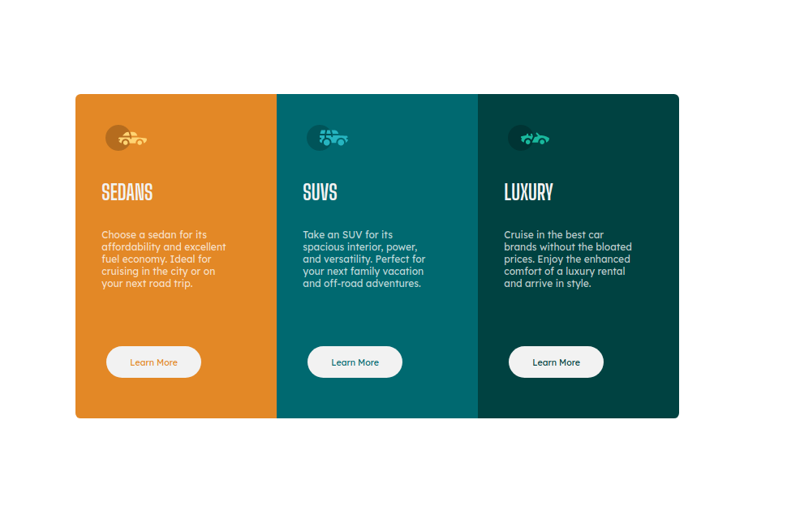

# Frontend Mentor - 3-column preview card component solution

This is a solution to the [3-column preview card component challenge on Frontend Mentor](https://www.frontendmentor.io/challenges/3column-preview-card-component-pH92eAR2-). Frontend Mentor challenges help you improve your coding skills by building realistic projects. 

## Table of contents

- [Overview](#overview)
  - [The challenge](#the-challenge)
  - [Screenshot](#screenshot)
  - [Links](#links)
- [My process](#my-process)
  - [Built with](#built-with)
  - [What I learned](#what-i-learned)
  - [Continued development](#continued-development)
  - [Useful resources](#useful-resources)
- [Author](#author)
- [Acknowledgments](#acknowledgments)


## Overview

### The challenge

Users should be able to:

- View the optimal layout depending on their device's screen size
- See hover states for interactive elements

### Screenshot



### Links

- Solution URL: [https://mahefasolofo.github.io/3-column-preview-card-component-main/](https://mahefasolofo.github.io/3-column-preview-card-component-main/)


## My process

### Built with

- Semantic HTML5 markup
- CSS custom properties
- Flexbox
- CSS Grid
- Mobile-first workflow


### What I learned

I learn to build a responsive site, 


```css
.proud-of-this-css {
  @media only screen and (max-width: xxxpx) {

  }
}
```


### Continued development

I want to continue with responsive website, usine @media queries for variable devices: phones, tablets, laptop and desktop.

### Useful resources

- [Responsive design](https://developer.mozilla.org/en-US/docs/Learn/CSS/CSS_layout/Responsive_Design) - This helped me for responsive website. This pattern is very usefull and the page MDN very clear.


## Author
- Website - [Solofo Mahefa](https://www.instagram.com/mahefasolofo/)
- Frontend Mentor - [@mahefasolofo](https://www.frontendmentor.io/profile/mahefasolofo)


## Acknowledgments

Thanks to Frontend Mentor for this inspiring concept. It boosts my conviction to learn.
